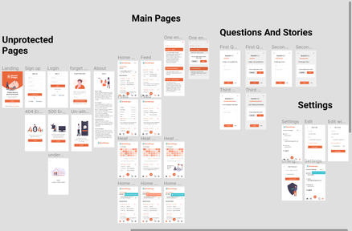

# Mental Snapp

###### tags:`Mental-Snapp` `Web App` `Startup`
### Summary :pencil:
Mental Snapp is a mobile-first web application which allows people in general and women in particular to write down about their feelings or life through answering a set of questions.

### Challenge :warning:
Users need a way to connect to their feelings so that they can accept themselves and feel confident that they can manage their lives.

### Solution :bulb: 
Mental Snapp supports users in developing an active self awareness so that they can reframe negative moods into positive ones and as a result they can move from victims to someones who are in control.

### Our App Figma Design: 

### User Stories :books:
<em>"As a user I want to be able to ...:"</em>

- [x] Create a new account or sign in by Google account.

- [x] Keep track of my main goal by seeing it on the top of the main page.

- [x] Edit my main goal by clicking on the edit icon next to it. 

- [x] Add a journal by clicking on the plus button (+).

- [x] Skip any question without entering any answer by clicking on the skip button.

- [x] Cancel adding journal by clicking on the exit button (x).

- [x] Delete a journal by clicking on the delete button inside the journal card.

- [x] See the timestamp which indicates when the user adds the journal inside journal card.

- [x] See the details of the journal card by clicking on the card itself

- [x] Track activity of the current day and month by clicking on the calendar icon.

- [x] See the journals of a specific day on the heatmap by clicking on a specific place for the day from the graph.

- [x] See journals of previous months by clicking on the list icon.

- [x] See the journals of a specific month by choosing it from the drop-down menu in the top page

- [x] See my account information from the setting page by clicking on the settings icon

- [x] Edit my account information by clicking on the edit button from the setting page.
